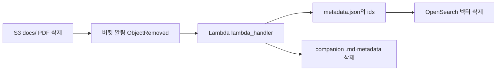

# RAG Multimodal

여기에서는 Knowledge Base로 처리할 수 없는 복잡한 RAG 문제를 Multimodal LLM을 직접 parsing하는 방법을 설명합니다. 문서에 복잡한 표나 그림이 있는 경우에 [일반적인 OCR 모델](https://github.com/kyopark2014/paddle-ocr)로 문서를 분석하기 어렵습니다. 반면에 [Multimodal을 이용한 OCR](https://github.com/kyopark2014/multimodal-ocr)은 사람의 관점으로 문서를 정리할 수 있어서, AI application에서 표나 그림을 이해하는데 크게 도움이 됩니다. 

파일업로드시 pdf의 경우에 각 page 단위로 이미지를 추출한 후에 OCR을 수행합니다. 이후 하나의 markdown 파일을 생성한 후에 chunking과 embedding후에 OpenSearch에 document를 추가합니다. Amazon S3에 저장된 파일이 삭제될 경우에는 해당 파일의 meta를 확인하여 OpenSearch에서 관련된 Document를 삭제합니다. OpenSearch에 저장되는 문서의 원할한 검색을 위해 metadata에 파일경로(url), 페이지 번호, 생성일, 생성자와 같은 정보를 추가하여 검색의 정확도를 높일 수 있습니다. 여기서는 데모 application을 위해 Streamlit을 이용합니다. Streamlit의 LangGraph agent는 OpenSearch를 검색하는 MCP를 이용하여 관련된 문서를 검색합니다. 이때, hybrid search를 이용해 vector와 lexical로 검색한 결과를 추출하고 관련도를 grading하여 관련도가 높은 문서를 context에 포함하여 적절한 답변을 생성합니다. 

전체적인 architecture는 아래와 같습니다. 개발환경은 Local PC를 기준으로 구성합니다. 사용자가 streamlit을 이용해 파일을 업로드하면 Amazon S3에 파일을 저장합니다. 업로드된 파일인 CloudFront URL을 이용해 사용자가 원본 문서를 참조할때 이용됩니다. Streamlit에서 업로드한 파일은 [multimodal.py](./application/multimodal.py)을 이용해 PDF와 같은 문서의 각 페이지를 이미지로 변환한 후애 multimodal LLM을 이용하여 markdown 파일 형태로 변환됩니다. 이 파일은 chunking과 embedding을 거쳐 OpenSarch에 push 되고, 생성된 chunked doc의 id가 Amazon S3에 metadata로 저장됩니다. 사용자가 Agent에 질문하면, opensearch MCP를 이용해 관련된 문서를 OpenSearch로 부터 조회하고, grading을 통해 적절한 문서를 선택하여 답변의 context로 활용합니다. 이후, 사용자가 더이상 문서를 활용하지 않는다고 판단되면 Amazon S3의 docs에 저장되어 있는 문서파일을 삭제합니다. 이때, Amazon Lambda가 delete event를 받아서 trigger되고, Amazon S3에 있는 문서의 metadata를 load하여 OpenSearch의 문서들을 삭제합니다. 


## Managed vs Serverless OpenSearch

Amazon OpenSearch Service는 **Managed(프로비저닝) Domain**과 **Serverless Collection** 두 가지 배포 모델을 제공합니다. [AWS 공식 비교 문서](https://docs.aws.amazon.com/opensearch-service/latest/developerguide/serverless-comparison.html)을 참조합니다. 여기에서는 지식저장소로 managed OpenSearch를 사용합니다. 

| 항목 | Managed OpenSearch (Domain) | Serverless OpenSearch (Collection) |
| --- | --- | --- |
| **기본 단위** | Domain — 사전 프로비저닝된 OpenSearch 클러스터 | Collection — 워크로드별 인덱스 논리 그룹 (클러스터/노드 개념 없음) |
| **용량 관리** | 인스턴스 타입·노드 수·EBS 용량을 직접 설계·조정 | OCU(OpenSearch Compute Unit) 기반 자동 스케일링 |
| **아키텍처** | 인덱싱·검색·스토리지가 동일 인스턴스에 결합 | 인덱싱(ingest)과 검색(query) 분리, S3를 주 스토리지로 사용 |
| **과금** | EC2 인스턴스 시간 + EBS 스토리지 | OCU-hours(ingest/search) + S3 보관 스토리지 |
| **암호화** | 저장 시 암호화 선택 | 저장 시 암호화 필수 |
| **접근 제어** | IAM + Fine-grained access control | Data access policy |
| **API·클라이언트** | OpenSearch Service API, 서명 시 서비스명 `es` | OpenSearch Serverless API, 서명 시 서비스명 `aoss` |
| **지원 API** | OpenSearch API의 부분 집합 | 별도의 부분 집합 (일부 API·플러그인 미지원) |
| **버전 업그레이드** | 수동 업그레이드 (호환성·breaking change 직접 검토) | 자동 업그레이드 (현재 2.17.x 계열) |
| **VPC** | Domain을 VPC 내부에 배치 가능 | Serverless VPC endpoint + network policy |
| **주요 사용 사례** | 예측 가능한 트래픽, 세밀한 튜닝·특정 플러그인 필요 | 간헐적·가변 워크로드, 운영 부담 최소화 |
| **벡터/RAG** | k-NN 인덱스·하이브리드 검색 직접 구성 | Vector search collection 타입 제공 (생성 후 타입 변경 불가) |
| **데이터 마이그레이션** | — | Domain → Collection 자동 마이그레이션 없음 (reindex 필요) |

**Managed OpenSearch**는 EC2 기반 Domain을 직접 구성·튜닝하는 방식입니다. 인스턴스 타입, 샤드, 스토리지, 플러그인, VPC 배치 등을 세밀히 제어할 수 있어 트래픽이 안정적이거나 커스텀 설정이 필요한 RAG·하이브리드 검색에 적합합니다.

**Serverless OpenSearch**는 클러스터 운영 없이 Collection만 생성하면 ingest/search OCU가 자동으로 확장·축소됩니다. S3 기반 분리 아키텍처로 인덱싱과 검색을 독립 스케일링하며, 사용량 기반 과금으로 간헐적·예측 어려운 워크로드에 유리합니다. Vector search collection은 RAG·시맨틱 검색용으로 제공되지만, 지원 API·플러그인 제한과 Domain 간 자동 마이그레이션 부재 등 제약이 있습니다.

이 프로젝트는 LangChain `OpenSearchVectorSearch`에서 `is_aoss=False`로 **Managed Domain**에 연결합니다. 하이브리드 검색(k-NN + lexical)과 parent/child 청크 구조를 직접 제어하기 위한 선택입니다.

## Advanced RAG 기법

RAG의 성능을 높이기 위해 이 프로젝트에 적용한 advanced RAG 기법을 정리합니다. 구현은 주로 [`application/multimodal.py`](./application/multimodal.py)(문서 인덱싱), [`application/mcp_rag_opensearch.py`](./application/mcp_rag_opensearch.py)(검색·하이브리드), [`application/mcp_server_text_extraction.py`](./application/mcp_server_text_extraction.py)(이미지→텍스트)에 있습니다.

### OCR

PDF를 페이지별 PNG로 렌더링한 뒤 멀티모달 LLM으로 Markdown을 추출하고, OpenSearch에 parent/child 청크로 적재합니다. 업로드 시 [`application/app.py`](./application/app.py)에서 `multimodal.sync_data_source()`를 호출하며, 내부 흐름은 `pdf_to_images` → `img2text` → `add_to_opensearch` 입니다.

Contextual embedding은 `chat.contextual_embedding`이 `'Enable'`일 때 parent/child 청크에 문서 전체 맥락을 붙입니다. 인덱스·검색용 OpenSearch 클라이언트와 벡터스토어는 아래와 같습니다.

[`application/mcp_rag_opensearch.py`](./application/mcp_rag_opensearch.py) — 검색·parent 조회·lexical 하이브리드:

```python
os_client = OpenSearch(
    hosts=[{"host": opensearch_url.replace("https://", ""), "port": 443}],
    http_compress=True,
    http_auth=awsauth,
    use_ssl=True,
    verify_certs=True,
    ssl_assert_hostname=False,
    ssl_show_warn=False,
    connection_class=RequestsHttpConnection,
)
```

[`application/multimodal.py`](./application/multimodal.py) — 문서 추가·삭제 시 벡터스토어:

```python
vectorstore = OpenSearchVectorSearch(
    index_name=index_name,
    is_aoss=False,
    embedding_function=bedrock_embeddings,
    opensearch_url=opensearch_url,
    http_auth=awsauth,
    connection_class=RequestsHttpConnection,
)
```

각 parent 청크가 전체 문서에서 어떤 위치·의미를 갖는지 설명하는 contextual text는 `get_contextual_docs_from_chunks`로 생성합니다 (`chat.get_chat()` 사용).

```python
def get_contextual_docs_from_chunks(whole_doc, splitted_docs):
    contextual_template = (
        "<document>"
        "{WHOLE_DOCUMENT}"
        "</document>"
        "Here is the chunk we want to situate within the whole document."
        "<chunk>"
        "{CHUNK_CONTENT}"
        "</chunk>"
        "Please give a short succinct context to situate this chunk within the overall document for the purposes of improving search retrieval of the chunk."
        "Answer only with the succinct context and nothing else."
        "Put it in <result> tags."
    )
    contextual_prompt = ChatPromptTemplate([("human", contextual_template)])
    # ...
    contextualized_chunk = output[output.find("<result>") + 8 : output.find("</result>")]
    contexualized_docs.append(
        Document(
            page_content="\n" + contextualized_chunk + "\n\n" + doc.page_content,
            metadata=doc.metadata,
        )
    )
```

페이지 이미지에서 텍스트를 뽑을 때는 적절한 성능과 토큰 사용량을 줄이기위해, 200만 픽셀, 5 MB 이하로 resize 한 후에 Bedrock 멀티모달로 Markdown을 추출합니다. [`application/mcp_server_text_extraction.py`](./application/mcp_server_text_extraction.py)의 `_prepare_image_base64` / `_extract_text_with_llm`을 [`multimodal.py`](./application/multimodal.py)의 `_extract_text_from_image`가 호출합니다.

```python
def _extract_text_from_image(image_path: str) -> str:
    with open(image_path, "rb") as f:
        raw = f.read()
    b64 = tex._prepare_image_base64(raw)
    raw_text = tex._extract_text_with_llm(b64, LLM_PROMPT)
    return tex._parse_result(raw_text).strip()
```

페이지별 Markdown을 `<page>N</page>` 태그로 이어 `rag_body`를 만든 뒤 `add_to_opensearch(rag_body, ...)`로 인덱싱합니다. S3에는 `markdown/{문서이름}.md`와 `metadata/{문서이름}.metadata.json`(벡터 `ids` 포함)이 저장됩니다.

대화형 **이미지 분석** 모드에서는 [`application/chat.py`](./application/chat.py)의 `extract_text` / `summary_image`로 텍스트 추출과 요약을 수행합니다 (`summary_image(img_base64, instruction)`).

```python
def summary_image(img_base64, instruction):
    query = "이미지가 의미하는 내용을 풀어서 자세히 알려주세요. markdown 포맷으로 답변을 작성합니다."
    if instruction:
        query = f"{instruction}. <result> tag를 붙여주세요. 한국어로 답변하세요."
    messages = [
        HumanMessage(
            content=[
                {"type": "image_url", "image_url": {"url": f"data:image/png;base64,{img_base64}"}},
                {"type": "text", "text": query},
            ]
        )
    ]
    result = llm.invoke(messages)
    return result.content
```

### Parent Child Chunking

검색은 작은 **child** 청크로 하고, 답변에 쓰는 본문은 **parent** 청크에서 가져옵니다. [`application/multimodal.py`](./application/multimodal.py)의 `add_to_opensearch`에서 `RecursiveCharacterTextSplitter`로 parent/child를 나눕니다.

```python
parent_splitter = RecursiveCharacterTextSplitter(
    chunk_size=2000,
    chunk_overlap=100,
    separators=["\n\n", "\n", ".", " ", ""],
    length_function=len,
)
child_splitter = RecursiveCharacterTextSplitter(
    chunk_size=400,
    chunk_overlap=50,
    length_function=len,
)
```

parent를 먼저 OpenSearch에 넣고, child metadata에 `parent_doc_id`와 `doc_level`을 넣습니다. contextual embedding이 켜져 있으면 parent에서 얻은 contextual text를 child `page_content` 앞에 붙입니다. 반환된 `ids`는 metadata JSON에 저장되어, [`lambda-s3-event-manager`](./lambda-s3-event-manager/lambda_function.py)가 PDF 삭제 시 OpenSearch 벡터를 지울 때 사용합니다.

```python
parent_doc_ids = vectorstore.add_documents(parent_docs, bulk_size=10000)
ids = parent_doc_ids

for i, doc in enumerate(parent_docs):
    _id = parent_doc_ids[i]
    child_docs = child_splitter.split_documents([doc])
    for _doc in child_docs:
        _doc.metadata["parent_doc_id"] = _id
        _doc.metadata["doc_level"] = "child"

    if chat.contextual_embedding == "Enable":
        contexualized_child_docs = []
        for _doc in child_docs:
            page_content = re.sub(r"\n<page>\d+</page>\n", "", _doc.page_content)
            contexualized_child_docs.append(
                Document(
                    page_content=contexualized_chunks[i] + "\n\n" + page_content,
                    metadata=_doc.metadata,
                )
            )
        child_docs = contexualized_child_docs

    child_doc_ids = vectorstore.add_documents(child_docs, bulk_size=10000)
    ids += child_doc_ids
```

검색 시 [`application/mcp_rag_opensearch.py`](./application/mcp_rag_opensearch.py)는 `metadata.doc_level: child`로 벡터 검색한 뒤, `parent_doc_id`로 parent 본문을 `os_client.get`으로 읽어 reference에 사용합니다. 하이브리드 검색이 켜져 있으면 lexical 검색 결과를 함께 합칩니다.

### 동기화

[app.py](./application/app.py)와 같이 streamlit에서 파일을 업로드 하면 아래와 같이 Amazon S3에 파일을 업로드하고, [multimodal.py](./application/multimodal.py)의 sync_data_source를 이용해 RAG로 활용됩니다.


```python
file_name = uploaded_file.name
file_url = chat.upload_to_s3(uploaded_file.getvalue(), file_name)

body = multimodal.sync_data_source(file_url)  # sync uploaded files
```

sync_data_source는 아래와 같이 경로에서 1) 파일명을 추출하고, 2) pdf에서 이미지를 추출한 후에 3) 각 이미지별로 text를 추출하고 OpenSearch에 push합니다.

```python
def sync_data_source(file_url: str) -> Optional[list[str]]:
    """PDF → images → LLM Markdown → S3, then trigger knowledge-base ingestion."""
    stem = _artifact_stem(file_url)
    images = pdf_to_images(file_url)
    extracted_body = img2text(images, filename=stem)
    return extracted_body if extracted_body else None
```

img2text에서는 이미지들로 부터 text를 추출한 후에 markdown 파일로 mergy합니다. 이때, 페이지정보는 <page> tag를 이용해 아래처럼 본문에 삽입합니다. add_to_opensearch는 이를 chunking하여 OpenSearch에 문서로 저장합니다. 저장된 문서의 리스트(ids)는 create_metadata를 이용해 Amazon S3의 metadata에 json으로 저장하여 추후 원본 파일이 업데이트시 OpenSearch의 문서를 삭제할 때에 활용됩니다.

```python
def img2text(images: list[str], filename: Optional[str] = None) -> list[str]:
    # Extract text from each image and save as a markdown file
    pages: list[str] = []
    for i, img_path in enumerate(images, start=1):
        body = _extract_text_from_image(img_path)
        pages.append(body)
    
    extracted_text = '\n'.join(pages)

    # Wrap each page with <page> tags for RAG page metadata
    rag_body = ""    
    for i, page in enumerate(pages):
        tag = f'\n<page>{i+1}</page>\n'
        rag_body += f"{page}{tag}"    

    # add to opensearch
    path = (config.get("sharing_url") or sharing_url or "").rstrip("/")    
    doc_url = f"{path}/{s3_prefix}/{filename}.pdf" if path else ""

    ids = add_to_opensearch(rag_body, name=filename, url=doc_url)

    # metadata for the document
    category = "upload"
    documentId = get_documentId(s3_key, category)
    create_metadata(bucket=s3_bucket, key=s3_key, meta_prefix=meta_prefix, url=doc_url or path + parse.quote(s3_key), category=category, documentId=documentId, ids=ids, files=saved)

    return extracted_text        
```

Streamlit에서 업로드한 PDF는 S3 `docs/`에 저장됩니다. 사용자가 S3에서 PDF를 삭제하면 **버킷 알림**이 `lambda-s3-event-manager` Lambda를 호출하고, 업로드 시 저장한 `metadata/*.metadata.json`의 `ids`로 OpenSearch 벡터를 정리합니다. 상세 배포는 [installer.md](./installer.md) §4, `python3 installer.py`의 `deploy_lambda_s3_event_manager()`를 참고하세요.

| 구성 | 내용 |
|------|------|
| 알림 대상 | `docs/` 프리픽스 (`s3_docs_prefix`) |
| 이벤트 | `s3:ObjectRemoved:*` (삭제·버전 삭제 등) |
| 수신자 | `lambda-s3-event-manager-for-{project_name}` |
| 알림 ID | `{project_name}-docs-s3-event` |



[`lambda-s3-event-manager/lambda_function.py`](./lambda-s3-event-manager/lambda_function.py)는 S3가 넘긴 `event["Records"]`에서 `eventName`이 `ObjectRemoved`로 시작하는 레코드만 처리합니다. handle_pdf_delete는 metadata.json 파일을 읽어서 OpenSearch에 push된 문서들을 정리합니다.

```python
def lambda_handler(event, context):
    for record in event["Records"]:
        bucket = record["s3"]["bucket"]["name"]
        key = record["s3"]["object"]["key"]
        event_name = record["eventName"]

        if event_name.startswith("ObjectRemoved"):
            handle_pdf_delete(bucket, key)  # metadata ids → OpenSearch 삭제
```


## 설치

### 사전 요구 사항

- Python 3.x
- AWS CLI 자격 증명이 구성된 상태 (`aws configure` 또는 환경 변수)
- `pip install -r requirements.txt`

### 인프라 배포

프로젝트 루트에서 installer를 실행합니다.

```bash
python3 installer.py
```

installer는 다음 리소스를 생성·구성합니다.

- S3 버킷 (`docs/` 프리픽스)
- Amazon OpenSearch Service 관리형 도메인 (`rag-multimodal`)
- CloudFront 배포
- **lambda-s3-event-manager**: S3 `docs/` PDF **삭제** 시 `metadata/*.metadata.json`의 `ids`로 OpenSearch 벡터 삭제 (IAM 역할 포함)

설치가 끝나면 `application/config.json`이 갱신됩니다.

### OpenSearch Dashboards (브라우저 접속)

installer는 OpenSearch **Fine-grained access control(FGAC)** 을 활성화하여 브라우저에서 Dashboards에 로그인할 수 있습니다. installer.py로 설치시 입력한 admin의 password를 이용해 접속합니다. 


### 인프라 삭제

```bash
python3 uninstaller.py
```
