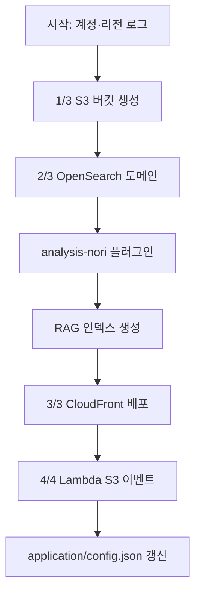

# 설치 가이드

[installer.py](./installer.py)는 CDK 스택과 동등한 AWS 인프라를 **boto3**로 생성·구성하는 스크립트입니다. RAG Multimodal 애플리케이션이 사용하는 S3, OpenSearch, CloudFront, Lambda(S3 이벤트)를 한 번에 배포하고, 결과를 `application/config.json`에 기록합니다.

## 사전 요구 사항

| 항목 | 설명 |
|------|------|
| Python 3.x | 스크립트 실행 환경 |
| AWS 자격 증명 | `aws configure` 또는 환경 변수로 계정·리전 접근 가능 |
| Python 패키지 | `pip install -r requirements.txt` (`opensearchpy`, `requests-aws4auth` 등) |
| 권한 | S3, OpenSearch/ES, CloudFront, IAM, Lambda, Secrets Manager API 호출 권한 |

실행:

```bash
python3 installer.py
```

삭제는 대응 스크립트 `uninstaller.py`를 사용합니다.

## 상단 설정 (변경 시 uninstaller와 맞출 것)

| 변수 | 기본값 | 의미 |
|------|--------|------|
| `project_name` | `rag-multimodal` | OpenSearch 도메인명·인덱스명·Lambda 이름 접두사 (3자 이상) |
| `region` | `us-west-2` | 모든 리소스 리전 |
| `bucket_name` | `storage-for-rag-project-{account_id}-{region}` | 문서 저장 S3 버킷 |
| `opensearch_domain_name` | `project_name`과 동일 | 관리형 OpenSearch 도메인 이름 |
| `OPENSEARCH_MASTER_USERNAME` | `admin` | Dashboards FGAC 마스터 사용자 |
| `S3_DOCS_PREFIX` | `docs/` | 업로드·이벤트 대상 프리픽스 |
| `cloudfront_comment` | `CloudFront-for-rag-project` | 기존 배포 재사용 시 식별용 Comment |

`sts.get_caller_identity()`로 **Account ID**를 읽어 버킷 이름 등에 사용합니다.

## 전체 실행 흐름

`main()`은 아래 순서로 진행합니다. 단계 번호는 로그의 `[n/m]` 표기와 대응합니다.



| 순서 | 함수 | 생성·구성 내용 |
|------|------|----------------|
| 1 | `create_s3_bucket()` | 문서 버킷, CORS, `docs/` 프리픽스 |
| 2 | `create_managed_opensearch_domain()` | 관리형 OpenSearch 도메인 + FGAC + Dashboards 정책 |
| — | `ensure_analysis_nori_plugin()` | 한국어 형태소 분석 플러그인 (선택적) |
| — | `ensure_opensearch_index()` | 하이브리드 RAG 인덱스 (`project_name`) |
| 3 | `create_cloudfront_distribution()` | S3 오리진 + OAI + HTTPS |
| 4 | `deploy_lambda_s3_event_manager()` | S3 `docs/` 이벤트 → Lambda |
| 마지막 | `config.json` 업데이트 | 앱이 참조하는 URL·ARN·비밀번호 등 |

코드에 `create_secrets()`(Weather/Tavily API 키) 호출은 **주석 처리**되어 있어, 기본 설치에서는 Secrets Manager를 만들지 않습니다.

## 1. S3 버킷 (`create_s3_bucket`)

- **이름**: `storage-for-rag-project-{account_id}-{region}`
- **리전**: `us-west-2` 등 `region` 변수 (us-east-1은 LocationConstraint 없이 생성)
- **보안**: 퍼블릭 액세스 차단 전부 활성화
- **CORS**: `GET`, `POST`, `PUT`, `AllowedOrigins: *` (브라우저/앱 업로드용)
- **버전 관리**: Suspended
- **폴더**: 빈 객체 `docs/` 생성 (이미 있으면 경고만)

버킷이 이미 있으면(`BucketAlreadyOwnedByYou`) 기존 버킷을 재사용하고 `docs/`만 보장합니다.

## 2. Amazon OpenSearch Service

### 2.1 도메인 생성 (`create_managed_opensearch_domain`)

**신규 도메인** 시 대략적인 스펙:

| 항목 | 값 |
|------|-----|
| 엔진 | `OpenSearch_3.5` |
| 인스턴스 | `r6g.large.elasticsearch` × 1 |
| 스토리지 | gp3 100GB |
| 암호화 | 전송·저장 시 암호화, HTTPS 강제 |
| FGAC | 설치 시 입력한 `admin` 비밀번호로 활성화 |

**기존 도메인**이 있으면:

- 엔드포인트가 있으면 재사용 (프로비저닝 중이면 최대 1시간 대기)
- 삭제 중(`Deleted`)이면 오류 후 재실행 안내
- FGAC가 없으면 마이그레이션 모드(`AnonymousAuthEnabled: true` 잠시)로 활성화 후 정책 정리

도메인 준비 대기(`_wait_for_opensearch_domain`)는 **최초 생성 시 약 20~40분** 걸릴 수 있습니다. 설정 변경만 진행 중(`Processing`이지만 엔드포인트 있음)이면 대기를 건너뜁니다.

### 2.2 마스터 비밀번호 (`prompt_opensearch_master_password_if_needed`)

- FGAC가 **이미 켜져 있으면** 비밀번호 입력을 건너뜁니다.
- 신규·FGAC 미설정 도메인은 `getpass`로 두 번 입력합니다.
- 규칙: 8~128자, 대문자·소문자·숫자 각 1자 이상.

입력한 비밀번호는 설치 시에만 `config.json`의 `managed_opensearch_dashboards_password`에 저장됩니다(`.gitignore` 대상).

### 2.3 Dashboards 접속 정책

FGAC로 실제 권한을 검사하되, 브라우저에서 Dashboards 로그인 화면까지 도달하려면 도메인 **액세스 정책**이 필요합니다.

1. `ensure_opensearch_fine_grained_access` — 기존 도메인에 FGAC 미적용 시 마이그레이션으로 활성화
2. `finalize_opensearch_dashboards_access` — `AnonymousAuthEnabled` 마이그레이션 모드 해제
3. `ensure_opensearch_access_policy` — IAM root + `Principal.AWS: *` 로 Dashboards HTTP 기본 인증 요청 허용

Dashboards URL: `{endpoint}/_dashboards` (함수 `_opensearch_dashboards_url`).

### 2.4 analysis-nori 플러그인 (`ensure_analysis_nori_plugin`)

한국어 lexical 검색용 AWS 관리 패키지 `analysis-nori`를 도메인에 연결합니다.

- 엔진 버전에 맞는 `ZIP-PLUGIN` 패키지 ID를 조회 후 `associate_package`
- 이미 연결·ACTIVE이거나 `nori` analyzer 테스트가 성공하면 스킵
- 패키지가 없으면 경고 후 **표준 analyzer**로 인덱스만 생성 (`use_nori=False`)

### 2.5 RAG 인덱스 (`ensure_opensearch_index`)

인덱스 이름 = `project_name` (`rag-multimodal`).

| 필드 | 타입 | 설명 |
|------|------|------|
| `text` | text (+ `my_analyzer` / nori) | 본문, 하이브리드 lexical |
| `vector_field` | knn_vector, dim=1024, HNSW/faiss | Bedrock 임베딩 벡터 |
| `metadata.*` | keyword, date, text 등 | source, project, title, url 등 |

`nori` 사용 시 커스텀 analyzer·품사 필터가 매핑에 포함됩니다. 인덱스가 이미 있으면 생성하지 않습니다.

클라이언트는 애플리케이션과 동일하게 **SigV4** (`AWS4Auth`, 서비스 `es`)로 연결합니다.

## 3. CloudFront (`create_cloudfront_distribution`)

- Comment `CloudFront-for-rag-project`인 배포가 있으면 **재사용** (비활성화돼 있으면 활성화)
- 없으면 **Origin Access Identity(OAI)** 생성 후 S3 버킷 정책에 `s3:GetObject` 허용
- S3 오리진 HTTPS, `redirect-to-https`, 캐시 정책 `658327ea-f89d-4fab-a63d-7e88639e58f6`
- 배포 완료까지 **15~20분** 추가 소요 가능 (로그에 안내)

정적 공유 URL은 `https://{cloudfront_domain}` → `config.json`의 `sharing_url`.

## 4. lambda-s3-event-manager (`deploy_lambda_s3_event_manager`)

소스: `lambda-s3-event-manager/` (핸들러 `lambda_function.lambda_handler`).

| 구성 요소 | 이름/내용 |
|-----------|-----------|
| Lambda | `lambda-s3-event-manager-for-{project_name}` |
| IAM 역할 | `role-lambda-s3-event-manager-for-{project_name}-{region}` |
| 런타임 | Python 3.12, 타임아웃 120초, 메모리 256MB |
| 배포 패키지 | `requirements.txt` pip install 후 zip |

**환경 변수**

| 변수 | 값 |
|------|-----|
| `s3_bucket` | 버킷 이름 |
| `s3_prefix` | `docs` |
| `meta_prefix` | `metadata/` |
| `opensearch_url` | 도메인 HTTPS 엔드포인트 |
| `vectorIndexName` | `project_name` |
| `region` | 리전 |

**S3 알림** (`docs/` 프리픽스):

- `s3:ObjectCreated:*` — 업로드·복사
- `s3:ObjectRemoved:*` — 삭제 시 OpenSearch 문서 정리 파이프라인

Lambda는 `metadata/*.metadata.json`의 `ids`를 읽어 OpenSearch에서 벡터를 삭제합니다(PDF 삭제 시 companion markdown/metadata 경로 매핑은 `lambda_function.py` 참고).

역할 권한: CloudWatch Logs, 해당 S3 버킷, OpenSearch 도메인 `es:ESHttp*`.

## 설치 결과: `application/config.json`

기존 파일이 있으면 **병합(update)** 하며, 아래 필드를 설정·갱신합니다.

| 필드 | 설명 |
|------|------|
| `projectName`, `accountId`, `region` | 프로젝트 식별 |
| `s3_bucket`, `s3_arn`, `s3_docs_prefix` | 문서 저장소 |
| `sharing_url` | CloudFront HTTPS URL |
| `managed_opensearch_url` | OpenSearch API |
| `managed_opensearch_arn` | 도메인 ARN |
| `managed_opensearch_dashboards_url` | Dashboards URL |
| `managed_opensearch_dashboards_user` | `admin` |
| `managed_opensearch_dashboards_password` | 설치 시 입력한 경우만 |
| `lambda_s3_event_manager_arn`, `lambda_s3_event_manager_name` | S3 이벤트 Lambda |

레거시 키 `lambda_s3_event_sqs_fifo_urls`는 제거됩니다.

## 멱등성·재실행

대부분의 단계는 **이미 존재하면 건너뛰거나 갱신**합니다.

- S3 버킷, OpenSearch 도메인, CloudFront(Comment 일치), Lambda, IAM 역할, Secrets(활성화 시), S3 알림 ID `rag-multimodal-docs-s3-event`
- OpenSearch 인덱스는 존재 시 생성 생략
- FGAC가 이미 있으면 비밀번호 프롬프트 생략 → `config.json`의 기존 비밀번호 필드는 재입력 없이 유지될 수 있음

실패 시 로그에 경과 시간과 traceback이 출력되고 예외가 다시 발생합니다.

## 소요 시간 요약

| 단계 | 대략적 시간 |
|------|-------------|
| OpenSearch 도메인 최초 생성 | 20~40분 |
| analysis-nori 연결 | 수 분 (도메인 설정 변경 포함 가능) |
| CloudFront 전파 | 15~20분 |
| S3·Lambda·인덱스 | 수 분 |

전체는 로그 마지막의 `Total deployment time`으로 확인합니다.

## 애플리케이션과의 관계

| installer 산출물 | 사용처 |
|------------------|--------|
| `managed_opensearch_url` | `multimodal.py`, `mcp_rag_opensearch.py` — 인덱싱·하이브리드 검색 |
| `s3_bucket`, `s3_docs_prefix` | `app.py`, `multimodal.py`, `chat.py` — 업로드·동기화 |
| `sharing_url` | CloudFront 경유 정적/공유 링크 |
| Lambda S3 이벤트 | PDF 등 삭제 시 OpenSearch 정리 (`lambda-s3-event-manager`) |

Streamlit 앱의 PDF 업로드·OCR·인덱싱은 installer가 만든 S3/OpenSearch 위에서 동작하며, 업로드 처리는 주로 앱(`multimodal.sync_data_source`)이 담당하고, **삭제 정리**는 Lambda가 담당합니다.

## 관련 파일

| 파일 | 역할 |
|------|------|
| `uninstaller.py` | installer가 만든 리소스 역순 삭제 |
| `lambda-s3-event-manager/lambda_function.py` | S3 이벤트 핸들러 구현 |
| `README.md` | 프로젝트 개요 및 installer 실행 요약 |
